Below is a ready-to-use tutorial session you can drop into your docs repo. It is written as hands-on training material, not as meta documentation, and fits your existing agent + Makefile workflow.

⸻

Tutorial Session: Working with the Claims Registry

From Source Code to Trusted Documentation

Audience
	•	Platform engineers
	•	Developer advocates
	•	Technical writers working close to code
	•	Maintainers of example repositories

Goal

Learn how to:
	•	Derive verifiable claims from source code and documentation
	•	Register them in the Claims Registry
	•	Reference them safely across tutorials
	•	Keep docs and claims synchronized over time

⸻

Why this matters

Documentation fails when:
	•	Claims drift away from reality
	•	Tutorials silently contradict each other
	•	Reviews focus on wording instead of truth

The Claims Registry solves this by introducing:
	•	One claim → many tutorials
	•	Evidence-backed statements
	•	Agent-enforced consistency

⸻

Mental model

Think of claims as APIs for documentation:

Code	Documentation
Function	Claim
Signature	Claim ID
Tests	Evidence
Breaking change	Claim update

⸻

Repository layout (recap)

examples/
├── claims/
│   ├── README.md
│   ├── kafscale-architecture.md
│   ├── kafka-compatibility.md
│   └── limitations.md
├── agents/
├── E20_spring-boot-kafscale-demo/
└── Makefile

⸻

Step 1: Identify candidate claims

Where do claims come from?

Claims originate from facts, not opinions:

Source	Typical claims
Source code	Behavior, guarantees, constraints
Integration tests	Compatibility, limits
Docs	Intended usage, exclusions
Architecture diagrams	Design decisions
Benchmarks	Performance characteristics

Example

From source code or docs you discover:

“KafScale brokers do not store log segments locally.”

This is a strong architectural claim → must go into the registry.

⸻

Step 2: Formulate a proper claim

A good claim is:
	•	Specific
	•	Testable
	•	Scoped
	•	Honest about limitations

Bad claim

“KafScale scales infinitely.”

Good claim

“KafScale brokers are stateless and can be horizontally scaled without partition reassignment.”

⸻

Step 3: Create a new claim entry

Open the appropriate file or create a new one under examples/claims/.

Example: kafscale-architecture.md

## KS-ARCH-002
**Claim:** KafScale brokers do not persist log segments on local disk.

**Scope:** Broker lifecycle, scaling, failure recovery

**Status:** Draft  
**Last reviewed:** 2026-01-02

**Evidence:**
- Source code: broker startup does not initialize local log dirs
- Documentation: https://kafscale.io/docs/architecture

**Implications:**
- Brokers can be replaced without data migration
- Storage and compute scale independently

**Limitations:**
- Relies on external object storage availability

Start with Draft. Verification comes later.

⸻

Step 4: Verify the claim

Verification requires at least one of:
	•	Source code reference
	•	Test or demo confirmation
	•	Official documentation
	•	Reproducible experiment

Once confirmed, update:

**Status:** Verified

Agents will treat Draft claims as warnings, not blockers.

⸻

Step 5: Reference the claim in tutorials

Now update tutorials without rephrasing the claim.

Example in a README

KafScale brokers are stateless and do not persist log segments locally  
(see claim: **KS-ARCH-002**).

Rules:
	•	Never restate the full claim elsewhere
	•	Never “improve” wording locally
	•	Always reference the ID

⸻

Step 6: Run the review pipeline

From examples/:

make review

This runs:
	•	EAAT review
	•	Didactical review
	•	Technical accuracy / claims verification

What agents check
	•	Are all strong claims backed by IDs?
	•	Do claims exist and match wording?
	•	Are limitations disclosed?
	•	Are claims reused consistently?

⸻

Step 7: Syncing claims across repositories

Scenario
	•	Source code lives in repo A
	•	Documentation lives in repo B (this repo)

Recommended workflow
	1.	Changes in code
	•	Developer updates or introduces behavior
	2.	Claim update
	•	Update or add claim in examples/claims/
	3.	Docs reference
	•	Tutorials remain unchanged or are updated automatically
	4.	PR review
	•	Agents flag mismatches immediately

Golden rule

Code changes → claims change → docs stay stable

⸻

Step 8: Handling claim changes

Breaking change?
	•	Update existing claim
	•	Add Deprecated status if needed

**Status:** Deprecated  
**Superseded by:** KS-ARCH-005

Agents will now flag tutorials referencing deprecated claims.

⸻

Step 9: Common anti-patterns (avoid these)
	•	Copying claims into READMEs
	•	Marketing language without claim IDs
	•	“Implicit” guarantees
	•	Tutorials introducing new facts

If it sounds like a promise → it’s a claim.

⸻

Step 10: Best practices
	•	Keep claims boring and precise
	•	Prefer fewer claims with strong evidence
	•	Always list limitations
	•	Review claims on release milestones

⸻

Outcome

After this session you have:
	•	A living, auditable Source of Truth
	•	Tutorials that cannot silently drift
	•	Reviews focused on substance, not wording
	•	EAAT implemented structurally, not rhetorically

 

 -----

 A claim life cycle diagram shows how a statement moves from an idea to a trusted, enforceable fact in your documentation system.

Below is a clear, implementation-oriented model that fits exactly to your agents, Makefile reviews, and claims registry.

⸻

Claim Life Cycle (Conceptual Diagram)

        ┌────────────────────┐
        │  Observation /     │
        │  Code Change       │
        └─────────┬──────────┘
                  │
                  ▼
        ┌────────────────────┐
        │  Claim Drafted     │
        │  (Status: Draft)  │
        └─────────┬──────────┘
                  │
        Evidence   │
        added      ▼
        ┌────────────────────┐
        │  Claim Verified    │
        │  (Status: Verified)│
        └─────────┬──────────┘
                  │
        Referenced │
        by docs    ▼
        ┌────────────────────┐
        │  Claim in Use      │
        │  (Referenced)     │
        └─────────┬──────────┘
                  │
        Code or    │
        behavior   ▼
        changes
        ┌────────────────────┐
        │  Claim Challenged  │
        │  (Needs Review)   │
        └─────────┬──────────┘
                  │
        ┌─────────┴──────────┐
        │                    │
        ▼                    ▼
┌────────────────┐   ┌──────────────────┐
│ Claim Updated  │   │ Claim Deprecated │
│ (Re-Verified)  │   │ (Superseded)     │
└────────────────┘   └──────────────────┘

⸻

Lifecycle Stages (Operational Meaning)

1. Observation / Code Change

Trigger
	•	New feature
	•	Architectural decision
	•	Removed capability
	•	Limit discovered

This is outside documentation.

Rule: No documentation change yet.

⸻

2. Claim Drafted

Status: Draft

Characteristics:
	•	Written in examples/claims/*.md
	•	Scoped
	•	Not yet trusted
	•	Agents allow but warn

Used when:
	•	Exploring new behavior
	•	Early demos
	•	Experimental features

⸻

3. Claim Verified

Status: Verified

Requirements:
	•	At least one evidence source:
	•	Source code
	•	Official docs
	•	Reproducible demo
	•	Limitations explicitly stated

Agents now treat this as authoritative truth.

⸻

4. Claim in Use

State: Referenced by tutorials

Effects:
	•	Tutorials reference claim ID
	•	No restatement allowed
	•	EAAT score improves
	•	Drift detection activated

Claims become contracts at this stage.

⸻

5. Claim Challenged

Trigger
	•	Code refactor
	•	Bug report
	•	Review feedback
	•	Performance regression

Agents flag:
	•	Mismatch between claim and material
	•	Unverified or outdated evidence

⸻

6a. Claim Updated (Re-Verified)

Used when:
	•	Behavior still exists but changed
	•	Scope narrowed or clarified

Actions:
	•	Update claim text
	•	Update evidence
	•	Keep same ID

⸻

6b. Claim Deprecated

Used when:
	•	Behavior no longer exists
	•	Replaced by a new mechanism

Status: Deprecated
Superseded by: KS-ARCH-007

Agents:
	•	Warn on usage
	•	Fail if used in new tutorials

⸻

Why this lifecycle works

Prevents documentation drift

Claims change → agents react → docs stay aligned

Enforces EAAT structurally
	•	Expertise: claims tied to code
	•	Authority: evidence-backed
	•	Accuracy: verified + enforced
	•	Trust: limitations included

Scales across teams
	•	Writers reference IDs
	•	Engineers maintain claims
	•	Review is automated

⸻

Mapping to your tooling

Lifecycle step	Tool
Draft	Claims registry
Verification	Human + agent
Usage	Tutorials
Enforcement	Makefile + agents
Drift detection	Claims verifier
Deprecation	Registry + agents

⸻

One-sentence summary

A claim is born in code, verified by evidence, enforced by agents, and retired explicitly — never silently.

```mermaid

stateDiagram-v2
    direction LR

    [*] --> Observation

    Observation : Code change\nArchitecture decision\nBehavior discovered
    Observation --> Drafted

    Drafted : Claim drafted\nStatus: Draft
    Drafted --> Verified : Evidence added\n(code / docs / demo)
    Drafted --> Deprecated : Abandoned idea

    Verified : Claim verified\nStatus: Verified
    Verified --> InUse : Referenced by tutorial(s)

    InUse : Claim in use\n(Referenced)
    InUse --> Challenged : Code change\nBug report\nReview feedback

    Challenged : Claim challenged\nNeeds review
    Challenged --> Verified : Clarified / Updated
    Challenged --> Deprecated : No longer valid

    Deprecated : Claim deprecated\nSuperseded or removed
    Deprecated --> [*]
	
```

